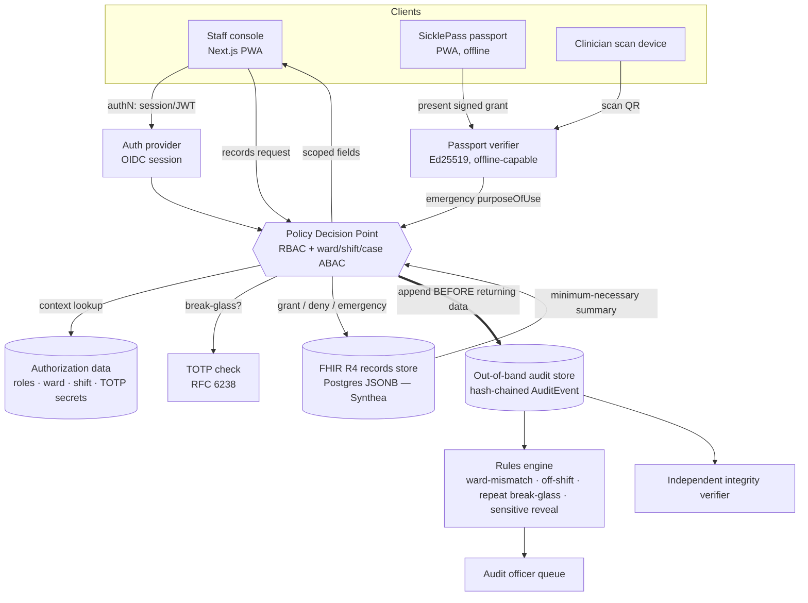

# Kofa — Safe Access to Patient Records
### Unified product concept, technical architecture, developer PRD, and Figma design guide
**ICSC 2026 Universities Hackathon · Track C (Health & Medical Systems) · "Safe Access to Patient Records"**

> **How to use this document.** Sections A–M are for the product/hackathon team. Section N is the developer PRD. Sections O–P are the Figma designer's brief. Sections Q–R cover phasing and risk. Every factual claim about Synthea, FHIR, or sickle-cell care is sourced in the References section; everything labelled *Decision* is an engineering recommendation, not a verified fact.

---

## A. Executive summary

Nigerian hospitals are digitising records faster than they are securing them. Access is all-or-nothing, logins are shared across shifts, and audit logs sit on the same machine they are meant to watch. Track C asks for a records layer where **what you see depends on role, ward and duty**, an **emergency override that cannot be hidden**, an **audit log that survives compromise of the main system**, at least one **abuse case caught**, and a **sensible offline answer**.

**Kofa** (Hausa: *gate*) is that layer. It sits in front of a mock FHIR records store and makes three guarantees: access is scoped by who you are and where/when you are on duty; emergencies always get in, but every emergency access is logged before the data is returned and is impossible to erase; and the log is hash-chained and stored separately, so tampering is detectable even by an attacker who owns the application server.

The sickle-cell thread — inherited from the **SicklePass** concept — is not a second product. It is the concrete emergency in which all of this is tested, and it supplies the payload the emergency door opens onto: a **minimum-necessary emergency summary** (genotype, allergies, current medications, transfusion history, complications, home facility) that a clinician can read in seconds during a vaso-occlusive crisis. Two SicklePass ideas earn their place in the build: this emergency summary with **source labelling** (patient-entered vs document-backed vs hospital-verified), and a **patient-carried, signed emergency passport** that lets the summary travel to a hospital that has never seen the patient — the exact gap ("records at ABUTH Zaria, patient in crisis in Abuja") that motivates the whole thing.

Everything else in SicklePass — patient-owned records as the source of truth, AI document extraction, wearable crisis prediction, adherence tracking — is either out of scope for Track C or a post-hackathon feature, and is treated as such below.

**Why the combined project is stronger than either alone.** Safe Access answers Track C but is generic and abstract; its break-glass demo is "a nurse crosses a ward." SicklePass has a visceral, locally-grounded story but answers a *different, unlisted* challenge and would score poorly against Track C's rubric on its own. Fused correctly — access layer as spine, sickle-cell emergency as the demo and the payload, patient passport as the consent path that complements institutional break-glass — the submission hits every Track C criterion **and** tells a story a judge remembers.

---

## B. Hackathon challenge analysis (Track C)

**Core problems.**
1. Over-permissive access exposes the most sensitive data that exists (HIV status, genotype, mental-health history) with life consequences.
2. Under-permissive access is *also* a safety failure — a clinician blocked from a chart in a real emergency harms the patient. A workable design must hold both true at once.
3. Audit is untrustworthy — logs live on the system they watch, so a breach erases its own evidence.

**Explicit requirements ("what to build").**

| # | Requirement | Where Kofa answers it |
|---|---|---|
| R1 | A records system, or a layer on a simple one, where visibility depends on **role, ward, and current duty** | §H access-control layer; §F permissions matrix; RBAC + ward/shift ABAC |
| R2 | A working **emergency override** that grants access immediately and makes that access **impossible to hide** | §K break-glass (TOTP + reason + persistent banner + auto-expiry + logged-before-grant) |
| R3 | An **access log that stays trustworthy even if the main system is compromised** | §H/§K hash-chained, append-only, **separately stored** AuditEvent log + independent verifier |
| R4 | A demonstration of **at least one abuse case being caught** (e.g. a clerk opening records of patients they never treated) | §K rules-based flagging → reviewer queue; §M demo step 6 |
| R5 | A short answer for **offline / system-down** behaviour | §H offline model; §M demo step 7 |

**Implicit requirements.** Staff move between wards/shifts and share devices (so identity must bind to *current* duty, not a static flag); the records system "was bought, not built" (so Kofa is a *layer*, never a replacement); very few IT staff, unstable power, weak internet (so the security model must degrade safely, not fail closed on the clinician); ransomware pressure is real (so availability of the emergency path matters as much as confidentiality).

**Target users.** Attending doctors, ward nurses, records clerks, visiting/locum doctors, lab/pharmacy staff, an audit/records-security officer, a hospital administrator. For the sickle-cell thread: the patient and (for paediatric SCD) a caregiver.

**Expected environment.** A single Nigerian hospital, paper-heavy with uneven digital layering, intermittent power and network. Judges reward honesty about failure modes and a thought-through offline story (see the global rules: "Think about power and network cuts").

**Constraints (global rules).** Synthetic/simulated data only; a working prototype, not a deck; free/open-source tools; a *prototype is enough*; explain where it fails.

**Security/privacy expectations.** Least privilege; minimum-necessary disclosure; sensitive-flag protection; undeniable emergency access; tamper-evident audit.

**Interoperability expectations.** Not explicitly required by Track C, but the free-tools note names Synthea, so a FHIR-shaped data model is the natural, credible choice and future-proofs the work.

**What judges are most likely to test or question.**
- *"Show me access being denied, then the same person getting in via break-glass."* — the core loop.
- *"Now tamper with the log and prove your system catches it."* — the integrity claim.
- *"If someone owns your server, what can they still fake?"* — they want an honest "detection, not prevention" answer (§R).
- *"What happens when the power's out and the patient is in front of the doctor?"* — the offline/emergency path.
- *"Why should a doctor NOT see every patient's record?"* — the least-privilege justification.
- *"Where did your data come from?"* — the Synthea + synthetic-roster provenance (§J).

---

## C. Safe Access + SicklePass merge analysis

Classified as **KEEP / MERGE / MODIFY / REMOVE**. The organising principle: *does it help win Track C?* Nothing is kept for being impressive.

### From Safe Access to Patient Records

| Idea | Verdict | Rationale |
|---|---|---|
| RBAC + ward/shift contextual scoping | **KEEP** | This *is* R1. The spine of the product. |
| Field-level visibility per role | **KEEP** | Directly serves least-privilege + minimum-necessary. |
| Break-glass: software TOTP, mandatory reason, persistent banner, auto-expiry | **KEEP** | This *is* R2. |
| Hash-chained, separately-stored, append-only audit log + independent verifier | **KEEP** | This *is* R3, and the strongest technical idea in either doc. |
| Rules-based anomaly flagging → reviewer queue | **KEEP** | This *is* R4; deterministic and explainable, which suits the timeframe. |
| Synthea patient data + team-built roster | **KEEP** | Correct data strategy (§J). |
| Offline as a *written* answer | **MODIFY** | Upgrade from "written answer only" to a *thin demonstrated* offline emergency path — the patient passport (below) makes this cheap to actually show, which scores better than a paragraph. |
| Full-blockchain / distributed ledger | **REMOVE** | Already correctly rejected in the doc; hash chaining gives the tamper-evidence property without consensus infra. Confirmed. |

### From SicklePass

| Idea | Verdict | Rationale |
|---|---|---|
| Minimum-necessary **emergency summary** (genotype, allergies, meds, transfusions, complications, home facility) | **MERGE** | Becomes the *payload* of the break-glass and consent doors — this is "minimum necessary disclosure" done concretely, and it is clinically grounded (§L). |
| **Source labelling**: patient-entered / document-backed / hospital-verified / recently-updated | **KEEP** | Genuinely strong trust feature; a clinician instantly knows how much to rely on a field. Cheap to build. |
| **Patient-carried signed emergency passport** (offline, QR) | **MERGE (scoped)** | This is the piece that bridges the cross-hospital gap Track C's single-institution framing can't. Kept as a *signed, offline-viewable* summary issued by the same system — **not** as a parallel patient-owned record store. |
| Patient-mediated **consent / revoke / access log / expiring share** | **MERGE** | Becomes the *consent path* to emergency access, complementing institutional break-glass. Track C and the brief both care about consent, which raw Safe Access lacked. |
| **Patient owns the record; hospital is optional** (phone as source of truth) | **REMOVE** | Directly conflicts with Track C: the records system "was bought, not built; you cannot replace it." The hospital FHIR store is the source of truth. The passport carries a *derived, signed summary*, not the record. This is the single most important correction to SicklePass. |
| **AI document extraction** (PDF → structured timeline, human-confirmed) | **MODIFY → SHOULD/FUTURE** | Useful, but not a Track C requirement, and it adds a hallucination surface judges will poke. Keep as an optional, clearly-bounded module with mandatory human confirmation; do not put it on the critical path. |
| Wearable / crisis-prediction (à la Sickle Sense) | **REMOVE** | Out of scope; a different (predictive) product with far higher safety/regulatory weight. |
| Appointment reminders, adherence tracking, lab-trend charts, full patient dashboard | **REMOVE (→ FUTURE)** | Chronic-care features; irrelevant to Track C's access/audit/emergency focus. |
| Clinician view: quiet, clinical, allergies/reactions first, source-labelled | **KEEP** | This is exactly the right shape for the emergency and authorised-view screens. |
| "Do not build a feature that tells the doctor what to prescribe" | **KEEP (as a hard non-goal)** | Correctly keeps us out of clinical-decision-support / regulated-device territory. |

**One conflict to flag honestly.** SicklePass §13 cites the "2026 UCT/Harvard health systems hackathon" but the accompanying URL is a *Yale* healthcare-hackathon page. The precedent claims are motivational, not technical, so this doesn't affect the build — but the citation is mismatched and shouldn't be repeated verbatim in the pitch.

---

## D. Unified product concept

**Product name.** **Kofa** — Hausa for *gate/door*. It reads as access-control ("the gate to patient records"), it nods to the *break-glass door*, and it carries local resonance for an ABU/Kaduna team. The patient-facing passport component keeps the name **SicklePass** as a sub-brand. *(If the team prefers a sickle-cell-forward pitch, "SicklePass" can lead and Kofa becomes the internal name of the access engine — but note that names the system after only its demo condition, undersell­ing a general access layer.)*

**One-sentence pitch.** *Kofa is an access-control and tamper-evident audit layer for hospital records where visibility follows your role, ward and shift — emergencies always get in but can never hide — with a patient-carried, signed emergency passport so a sickle-cell patient's critical history reaches a hospital that has never seen them.*

**Problem.** (See §B.) Records are exposed by all-or-nothing access and untrustworthy logs; yet clinicians must never be blocked in an emergency; and a travelling patient's history is trapped in one hospital.

**Target users.** Clinical + records staff of one hospital (primary); sickle-cell patients and their caregivers (for the passport).

**Core value proposition.**
- *For the hospital:* least-privilege access without blocking emergency care, plus a log a court or auditor can trust even after a breach.
- *For the patient:* the safety-critical parts of their record travel with them, minimum-necessary and consented, working offline.

**Primary workflows.** (1) Scoped read of a chart; (2) denied out-of-scope read; (3) institutional break-glass into the emergency summary; (4) patient-consented passport view of the same summary; (5) audit-officer review of flagged access; (6) integrity verification of the log.

**What makes it technically distinctive.**
- Authorization is **ABAC over RBAC**: the decision depends on role *and* live context (ward assignment, active shift, case attachment), not a static permission bit.
- The audit log is **AuditEvent-shaped but hash-chained and stored out-of-band**, giving a standards-aligned schema *and* the tamper-evidence FHIR doesn't natively provide.
- The emergency path has **two doors into one minimum-necessary view** — institutional break-glass (patient can't consent) and patient passport (patient can) — both logged identically.
- The passport is a **signed, offline-verifiable capability**, not a copy of the record — portability without creating a second uncontrolled data store.

**Why stronger than either concept independently.** Safe Access wins Track C but is forgettable; SicklePass is memorable but off-target. Kofa keeps Safe Access's rubric-hitting spine and borrows exactly the three SicklePass elements (emergency summary + source labelling + consented portable passport) that turn an abstract access-control demo into a concrete, local, human one — without importing SicklePass's scope-exploding parts.

---

## E. Users & personnel

Only roles with a genuine workflow are included. Emergency personnel is **not** a standalone role in the MVP: in a single hospital the emergency actor is a doctor or nurse invoking break-glass. A distinct pre-hospital EMS role and a platform (multi-tenant) admin are deferred to FUTURE.

| Role | Real workflow in Kofa | Scope drivers (ABAC) |
|---|---|---|
| **Attending doctor** | Full clinical view for patients on their case; break-glass eligible | case attachment, shift |
| **Nurse** | Ward-scoped clinical view (sensitive flags hidden by default, reveal-on-demand logged); break-glass eligible | ward, shift |
| **Records clerk** | Demographics + billing only; registers/retrieves patients | facility |
| **Visiting / locum doctor** | Time-boxed clinical view during rostered hours; sensitive flags redacted | rostered hours, facility |
| **Lab / pharmacy staff** | Order-relevant fields + own orders only; name+ID for matching | order linkage |
| **Audit / records-security officer** | Reviews the flag queue, runs the integrity verifier, sees full audit (not clinical detail beyond what a flag needs) | facility-wide audit scope |
| **Hospital administrator** | Manages roster (roles, ward/shift assignments), provisions TOTP enrolment, cannot read clinical records | facility admin, no clinical read |
| **Patient** | Holds the SicklePass passport, grants/revokes emergency consent, sees own access log | self |
| **Caregiver / guardian** | Holds the passport for a dependent (paediatric SCD is common); same consent controls | linked dependent |

*Decision:* the **administrator has no clinical read**. Separating "manages access" from "sees records" is a deliberate least-privilege boundary judges will appreciate.

---

## F. Permissions / feature-gating matrix

**Legend:** ✔ = allowed in normal scope · ▢ = allowed only within ABAC context (on-ward / on-shift / on-case / rostered) · ⚡ = reachable via break-glass or patient consent (logged) · ✖ = never · *reveal* = hidden by default, shown on logged request.

### Data fields

| Field | Patient | Caregiver | Doctor (on case) | Nurse (on ward) | Records clerk | Locum doctor | Lab/Pharmacy | Audit officer | Admin |
|---|---|---|---|---|---|---|---|---|---|
| Demographics | ✔(self) | ✔(dep.) | ▢ | ▢ | ✔ | ▢ | name+ID | ✖ | ✖ |
| Diagnosis / conditions | ✔ | ✔ | ▢ | ▢ | ✖ | ▢(rostered) | order-relevant | ✖ | ✖ |
| Deep clinical history | ✔ | ✔ | ▢ | summary | ✖ | ✖ | ✖ | ✖ | ✖ |
| Meds & labs | ✔ | ✔ | ▢ | ▢ | ✖ | ▢ | own orders | ✖ | ✖ |
| Sensitive flags (HIV, mental health, **genotype**) | ✔ | ✔ | ▢ (own access self-audits) | *reveal* | ✖ | redacted | ✖ | ✖ | ✖ |
| Billing / HMO | ✖ | ✖ | view | ✖ | ✔ | ✖ | ✖ | ✖ | ✖ |
| **Emergency summary** (the passport payload) | ✔ | ✔ | ⚡✔ | ⚡✔ | ✖ | ⚡ | ✖ | ✖ | ✖ |
| Audit log | own events | dep. events | ✖ | ✖ | ✖ | ✖ | ✖ | ✔(full) | ✖ |

### Capabilities

| Capability | Patient | Caregiver | Doctor | Nurse | Records clerk | Locum | Lab/Pharm | Audit | Admin |
|---|---|---|---|---|---|---|---|---|---|
| View (in scope) | self | dep. | ▢ | ▢ | ▢ | ▢ | ▢ | audit only | ✖ |
| Create / edit clinical record | ✖ | ✖ | ▢ | ▢(notes/vitals) | ✖ | ▢ | order results | ✖ | ✖ |
| Break-glass (invoke) | n/a | n/a | ✔ | ✔ | ✖ | ✖ | ✖ | ✖ | ✖ |
| Grant / revoke emergency consent | ✔ | ✔(dep.) | ✖ | ✖ | ✖ | ✖ | ✖ | ✖ | ✖ |
| Review flag queue / run verifier | ✖ | ✖ | ✖ | ✖ | ✖ | ✖ | ✖ | ✔ | ✖ |
| Manage roster / roles / TOTP enrolment | ✖ | ✖ | ✖ | ✖ | ✖ | ✖ | ✖ | ✖ | ✔ |
| Export | own | dep. | ✖(MVP) | ✖ | ✖ | ✖ | ✖ | ✖ | ✖ |

*Break-glass overrides **which patient** a role may reach (case/ward scoping), not **which fields** their role sees* — a nurse who breaks glass still gets the nurse-level field view, not a doctor's. This keeps least-privilege intact even in an emergency.

---

## G. Core user journeys

1. **Scoped read (happy path).** Nurse authenticates → selects active role/ward/shift → opens a patient on her ward → access layer checks role+ward+shift → grants nurse-level field view (sensitive flags hidden) → one AuditEvent (grant) hash-chained.
2. **Out-of-scope deny.** Same nurse opens a patient on another ward → check fails → deny screen offers "request break-glass (emergency only)" → one AuditEvent (deny).
3. **Break-glass (patient can't consent).** ED doctor hits an unconscious SCD patient out of scope → invokes break-glass → enters TOTP + selects/enters reason → **AuditEvent written before data returns** → minimum-necessary emergency summary opens with a persistent banner (who/why/countdown) → auto-expires; event lands in the audit officer's queue.
4. **Consent path (patient can consent).** Conscious patient presents SicklePass QR → clinician's device scans → signature verified (works offline) → same emergency summary shown → AuditEvent (consented access) recorded; patient sees it in their own access log.
5. **Audit review + tamper test.** Officer opens queue → reviews the break-glass event → then a demo tamper edits a past row → integrity verifier walks the chain → detects the break → flags the exact entry.
6. **Abuse caught.** Records clerk opens 5 charts of patients never at their desk (or a doctor break-glasses repeatedly) → rules engine flags ward-mismatch / repeat-break-glass → queue surfaces it top-first.
7. **Offline.** Network drops → passport still renders from secure cache; hospital layer serves read-only cached scope and **queues audit events that hash-chain into the main chain on reconnect** (no gaps, ordering preserved).

---

## H. Technical architecture

**Shape.** A thin, single decision-point access layer in front of a mock FHIR records store, plus an out-of-band audit store and a stateless passport verifier. Everything routes through one **Policy Decision Point (PDP)**; nothing reads the records store directly.

**Stack (Decision — all free/OSS, matches the team's existing skills).**
- **Client:** Next.js (App Router) + TypeScript + Tailwind + shadcn/ui. One codebase serves the staff console and the patient/clinician passport pages. PWA for the offline passport.
- **Backend/API:** Next.js route handlers (or a small Node/Express service) exposing a records-access API. The PDP is a server-side module every records call passes through.
- **Records store:** PostgreSQL holding FHIR R4 resources (as JSONB) loaded from Synthea, or a lightweight FHIR server (e.g. HAPI FHIR in a container) if the team wants real FHIR search. *For a 3-week build, Postgres+JSONB is simpler and sufficient.*
- **Audit store:** a **separate** append-only table/service (own DB or at minimum a separate schema with insert-only grants), storing hash-chained `AuditEvent` rows. Physical/logical separation is the point of R3.
- **Auth:** session auth via an established provider (Supabase Auth / Auth.js) issuing short-lived JWTs carrying `sub`, `role`, and a session id — **not** ward/shift (those are looked up live, see below).
- **TOTP:** RFC 6238 (e.g. `otplib`) for break-glass.
- **Passport signing:** Ed25519 (via WebCrypto / `@noble/ed25519`) — the facility signs the emergency summary; the verifier checks the signature offline.
- **Deployment:** Docker Compose (app + Postgres + audit DB) on a normal laptop; no cloud dependency, per the rules.

**Authentication vs authorization (kept separate).**
- *Authentication* proves who the user is (session/JWT).
- *Authorization* is decided **per request** by the PDP, which combines the token's role with **live context**: is this user currently assigned to this ward? on an active shift? attached to this patient's case? within rostered hours (locum)? Context is read from the roster/authorization data at decision time, never baked into the token — because staff move wards and shifts constantly and share devices. A stale token must not carry stale access.

**Emergency access.** Two entry points into the PDP's "emergency" mode: institutional break-glass (TOTP-gated) and passport consent (signature-gated). Both force `purposeOfUse = emergency`, both cap disclosure to the emergency-summary field set, both write the AuditEvent *before* returning data.

**Consent.** Patient emergency-share grants are stored as consent records (target: FHIR `Consent`) with an expiry and a revoke flag; the passport embeds a signed, expiring grant.

**Audit logs.** Every PDP decision (grant/deny/emergency) → one AuditEvent appended to the out-of-band chain: `{ seq, timestamp, actor, role, patient, action, decision, purposeOfUse, reason?, prevHash, hash }` where `hash = SHA-256(canonical(entry_without_hash) + prevHash)`. An independent verifier recomputes the chain and reports the first break.

**Data sharing.** Within the hospital: none beyond the PDP. Across hospitals: the signed passport only (a derived summary, never the full record). Multi-facility live sharing (HL7/FHIR referral) is FUTURE.

**Offline / poor connectivity.** (1) *Passport* is cached in the PWA and renders + verifies its signature with no network. (2) *Hospital layer* degrades to read-only cached scope; audit events are queued locally and hash-chained into the main chain on reconnect, preserving order — so an outage can't silently drop or reorder evidence. (3) The core emergency screen never depends on an AI call.

**Encryption.** In transit: HTTPS/TLS everywhere. At rest: DB-level encryption for the records and audit stores; the passport payload is signed (integrity) and the sensitive fields are encrypted to the patient's key. Session tokens are short-lived; break-glass sessions are additionally time-boxed.

**Session/device security.** Shared devices are assumed, so sessions are short and role/ward selection happens per login; break-glass never persists past its expiry; a lost passport is mitigated by expiry + revoke + optional PIN before sensitive fields render.

**Notifications.** Break-glass and consented-access events notify the audit officer's queue immediately; the patient sees consented/break-glass access in their own log. (Real-time push is SHOULD; in-app queue is MUST.)

**Administrative functions.** Roster management, role/ward/shift assignment, TOTP enrolment — all admin-only, all logged, none granting clinical read.

**Interoperability — where standards fit, and where they don't.**
- **FHIR R4 for the data model: YES.** It's what Synthea emits, it's the lingua franca, and it future-proofs the store. Use `Patient, Condition, Observation, MedicationRequest, AllergyIntolerance, Procedure, Encounter, Practitioner, PractitionerRole, Organization, Location`.
- **FHIR `AuditEvent` for the audit schema: YES**, but extend it with the hash-chain fields and store it out-of-band. FHIR gives the shape; FHIR does **not** give tamper-evidence — that's ours.
- **FHIR `Consent` for consent: target YES, MVP optional.** Model emergency-share grants as Consent in the "should build"; a simpler grant record is fine for the demo.
- **SMART on FHIR / full OAuth2 launch: NO for the hackathon.** It's the right *production* pattern and the design leaves room for it (scopes map cleanly onto our field-level rules), but implementing a SMART launch in 3 weeks costs days and earns no rubric points. Use plain OIDC/session auth now; note SMART as the migration path.
- **Terminology: YES, reuse Synthea's.** SNOMED CT (conditions, incl. sickle-cell anaemia), LOINC (labs/observations, incl. haemoglobin electrophoresis), RxNorm (medications, incl. hydroxyurea). Don't invent codes.
- **Break-the-glass security label:** align `purposeOfUse` with HL7 v3 `ActReason` (`ETREAT`/`BTG`) so the emergency flag is standards-named rather than proprietary.

### Architecture / data-flow diagram

---

## I. Healthcare data architecture

Six data categories, deliberately separated so that a breach of one doesn't compromise the others (and so the demo can show clean boundaries).

| Category | Contents | Store | Source |
|---|---|---|---|
| **Clinical** | Patient, Condition, Observation, Medication, Allergy, Procedure, Encounter, DiagnosticReport | FHIR R4 (Postgres JSONB / HAPI) | Synthea + SCD overlay (§J) |
| **Identity / account** | user accounts, credentials, patient↔passport link, caregiver↔dependent link | Auth DB | Custom synthetic |
| **Authorization** | roles, ward assignments, shift schedule/roster, case attachments, locum rostered hours, TOTP secrets | Roster DB | Team-built synthetic |
| **Consent** | emergency-share grants, expiry, revocation, break-glass reasons | Consent table (→ FHIR Consent) | App-generated |
| **Audit / security** | hash-chained AuditEvents, anomaly flags, verifier results | **Separate** append-only store | App-generated |
| **Application-generated** | passport tokens/signatures, share links, notifications, session state | App DB | App-generated |

**Emergency-summary data model** (the passport payload — a derived, signed view, not a new record):
`patient_display` (name, photo?, DoB) · `genotype` (HbSS/HbSC/HbSβ-thal, only if confirmed) · `allergies_reactions` · `current_medications` (incl. hydroxyurea, chronic transfusion, personalised analgesia note) · `transfusion_history` · `key_complications` (ACS, stroke, priapism, AVN, CKD-affecting-NSAIDs) · `home_facility_and_contact` · `emergency_contact` · `last_updated` · `source_label` per field (patient-entered / document-backed / hospital-verified) · `issuer_signature`.

---

## J. Synthea / FHIR verification & mapping

**Verified facts (see References):**
- Synthea exports **FHIR R4 by default**, one transaction Bundle per patient, with Organizations/Practitioners exported separately; CSV, C-CDA, CPCDS and bulk ndjson are opt-in. It "includes required fields but rarely populates optional fields."
- Its modelled data spans demographics, encounters, conditions, medications, procedures, observations/vitals, immunisations, care plans, **allergies**, devices and imaging studies, coded in SNOMED/LOINC/RxNorm.
- Demographics default to **US Census** distributions (Massachusetts by default; other US states selectable). Names, addresses and insurance are US-shaped.
- There is **no first-party, validated sickle-cell module** in the standard Synthea set. SCD is produced via **custom/community modules** (e.g. a `ConditionOnset` targeting "sickle cell disease"), or the condition can be added through Synthea's Generic Module Framework.
- Genomic/genotype data exists only in **special datasets** (e.g. the Coherent dataset), **not** in the standard export.

**Mapping table.**

| Product data requirement | Why needed | Synthea available? | FHIR resource / source | Synthetic / Derived / Custom | Notes |
|---|---|---|---|---|---|
| Patient demographics | identity, matching | **Yes** | `Patient` | Synthetic (overlay names/addresses) | US-localised → overlay Nigerian names/addresses/phone; keep Synthea's structure |
| Conditions / diagnoses | clinical view, SCD status | **Yes** (generic) | `Condition` (SNOMED) | Synthetic + Custom | SCD itself needs a custom module or GMF state |
| Encounters | history, ED visits | **Yes** | `Encounter` | Synthetic | VOC ED visits need the SCD module to emit them |
| Observations / vitals | clinical context, baseline | **Yes** | `Observation` (LOINC) | Synthetic | |
| Lab results (Hb, retic) | baseline Hb, transfusion context | **Yes** | `Observation`/`DiagnosticReport` (LOINC) | Synthetic + Custom | baseline Hb sensible; SCD-specific labs may need overlay |
| Medications (hydroxyurea, folic acid, opioids) | current meds, reactions | **Yes** (generic) | `MedicationRequest` (RxNorm) | Synthetic + Custom | SCD meds appear only if the module models them |
| Allergies / reactions | safety-critical | **Yes** | `AllergyIntolerance` | Synthetic | |
| Procedures (transfusion, exchange transfusion) | transfusion history | **Yes** (generic) | `Procedure` (SNOMED) | Custom | must be added via the SCD module |
| Immunisations | context | **Yes** | `Immunization` | Synthetic | |
| Care plans (personalised analgesia) | emergency dosing note | **Yes** (generic) | `CarePlan` | Custom | personalised pain plan is custom demo content |
| **Genotype (HbSS/HbSC/HbSβ-thal)** | core SCD field | **No (standard export)** | `Observation` (LOINC Hb electrophoresis) | **Custom** | build as a coded Observation in the overlay; do **not** claim Synthea emits it |
| Providers | role/identity | **Yes** | `Practitioner`, `PractitionerRole` | Synthetic | |
| Organizations / wards | facility, ward/location | **Yes** | `Organization`, `Location` | Synthetic | maps to ward scoping |
| **Ward/shift roster, case attachment** | ABAC context | **No** | — | **Custom (team-built)** | the authorization layer Synthea has no concept of |
| **TOTP secrets, break-glass reasons** | emergency access | **No** | — | **Custom** | |
| **Consent grants / passport tokens** | consent path | **No** | (→ FHIR `Consent`) | **Custom** | |
| **Hash-chained audit** | R3 | **No** | (→ FHIR `AuditEvent` + extension) | **Custom** | |
| Insurance / coverage | records-clerk billing view | **Yes (US)** | `Coverage`/`Claim`/`EOB` | **Custom (Nigerian HMO)** | Synthea's US claims are misleading here; use a simple synthetic HMO field |

**Bottom line for the team:** Synthea gives you a realistic clinical spine for free, but **four things are yours to build** — the SCD overlay (genotype, transfusion, personalised plan), the Nigerian localisation overlay, the entire authorization/roster layer, and all consent/audit/passport data. Say exactly this when a judge asks "where did your data come from?"

---

## K. Security, consent & emergency access model

**Normal access (technical steps).** authenticate → PDP reads role from token + live context (ward/shift/case/rostered) from roster → evaluate field-level rules → return only permitted fields → append AuditEvent(grant). Out-of-scope → return deny + offer emergency path → append AuditEvent(deny).

**Emergency access — door 1: institutional break-glass** (patient can't consent):
1. Clinician invokes break-glass on a denied chart.
2. **Identity re-verification:** enter current TOTP (RFC 6238).
3. **Mandatory reason:** preset (e.g. "unconscious patient", "VOC, patient in crisis") + free text.
4. **AuditEvent written before any data is returned** (`purposeOfUse = BTG/ETREAT`, reason attached, hash-chained).
5. **Minimum-necessary disclosure:** only the emergency-summary field set, at the invoker's role level.
6. **Persistent, undismissable banner:** who invoked, why, live countdown.
7. **Auto-expiry + lockout** at the window's end.
8. Event lands in the audit-officer queue, flagged.

**Emergency access — door 2: patient passport consent** (patient can consent):
1. Patient/caregiver opens SicklePass, generates a **signed, expiring QR grant** (optionally PIN-protected).
2. Clinician device scans → **Ed25519 signature verified offline** → grant not expired/revoked.
3. Same minimum-necessary emergency summary shown; AuditEvent(consented access) recorded; patient sees it in their own log.
4. Patient can **revoke** an active grant; expiry auto-closes it.

**Minimum-necessary** is enforced structurally: the emergency path can only ever return the emergency-summary projection, never the full record — so even a compromised clinician session on this path leaks a bounded set.

**Suspicious-access detection (rules, not ML — deliberate, explainable):** ward mismatch, off-shift access, repeated break-glass by one actor, burst of distinct patients by a clerk, sensitive-field reveals. Each rule is a one-line predicate a judge can read. Honest limit: deterministic rules miss novel patterns (§R).

**Lost / stolen device.** Passport: expiry + revoke + optional PIN before sensitive fields; the passport carries a *summary*, not the record, so exposure is bounded. Staff device: short sessions, per-login role/ward selection, break-glass never persists.

**What "secure" concretely means here** (not "make it secure"):
- *Confidentiality:* no field leaves the PDP that the role+context+consent doesn't permit; sensitive flags hidden-by-default with logged reveal.
- *Integrity:* every access is hash-chained; any edit to a past entry is detectable by the independent verifier.
- *Non-repudiation of emergencies:* the AuditEvent is written **before** data returns, so access can't happen without a record.
- *Availability:* the emergency path and the offline passport must work under power/network loss.
- *Least privilege:* role ≠ god-mode; break-glass widens *which patient*, never *which fields*.

---

## L. Sickle-cell-specific experience

**Design line (hard non-goal):** Kofa surfaces information so a clinician understands the patient fast. It does **not** recommend drugs, dose opioids, or decide anything — that would turn a record-sharing tool into a regulated clinical-decision-support system. This is stated in both the product and the UI.

**What the emergency summary should surface, and why it's clinically relevant** (grounded in ASH 2020 / NHLBI / EDSC3 point-of-care guidance — see References; these justify *inclusion*, they are not clinical advice):
- **Confirmed genotype** (HbSS / HbSC / HbSβ-thal) where recorded — standard SCD record content and a routine field in ED SCD tools.
- **Allergies & serious medication reactions** — safety-critical, shown first.
- **Current medications** — hydroxyurea, folic acid, chronic-transfusion status, and any **personalised analgesia plan**: ASH/NHLBI-aligned ED tools explicitly value pulling an individualised analgesic plan from the record, because the cornerstone of VOC care is *rapid* analgesia (first dose ideally within ~30–60 min of arrival). A ready plan removes a lookup delay.
- **Transfusion history** — informs transfusion decisions and alloimmunisation risk; ASH has a dedicated transfusion-support guideline and a conservative Hb threshold (~10 g/dL).
- **Key complications** — acute chest syndrome, stroke, priapism, avascular necrosis, and **CKD** (which can preclude NSAIDs like ketorolac in up to a third of adults) — context that changes safe management without telling the clinician what to do.
- **Baseline Hb / recent labs** — there is *no* lab that confirms or excludes a VOC, so the value is baseline context, not diagnosis.
- **Home facility & treating clinician + emergency contact** — enables call-back and continuity (the ABUTH-in-Zaria / crisis-in-Abuja gap).

**Two clearly-separated tiers:**
- *Tier 1 — patient-understanding (BUILD):* the summary above. Read-only, source-labelled, minimum-necessary.
- *Tier 2 — clinical decision support (DO NOT BUILD):* dosing, triage scoring, crisis prediction. Higher safety/regulatory weight; explicitly excluded for the MVP and flagged as such.

**Source labelling** (kept from SicklePass) makes Tier 1 trustworthy: every field shows *patient-entered / document-backed / hospital-verified / last-updated*, so a clinician instantly calibrates how much to lean on it. Hospital-verified fields are signed by the issuing facility in the passport.

**Nigerian grounding (context, sourced to SicklePass's cited study — treat as that study's figures, not independently re-verified here):** a 2024 pilot on an SCD electronic registry at ABUTH Zaria reported the hospital's EHR was mainly capturing demographics and described a large SCD caseload — i.e. the exact place where a portable, structured SCD summary would matter. SCD is highly prevalent across sub-Saharan Africa, which makes the wedge locally real rather than invented.

---

## M. Hackathon MVP & demo strategy

**MUST BUILD (core demo + every Track C criterion).**
- Auth + per-login role/ward/shift selection.
- PDP: RBAC + ward/shift/case ABAC, field-level rules.
- Scoped chart view + out-of-scope deny.
- Break-glass: TOTP + reason + persistent banner + auto-expiry.
- Emergency summary projection (sickle-cell payload) with source labels.
- Hash-chained, separately-stored AuditEvent log + independent verifier.
- Rules-based flagging → audit-officer queue.
- One abuse-case script (ward-crossing clerk / repeat break-glass).
- Synthea data + SCD overlay + Nigerian localisation + synthetic roster.
- Offline: cached passport that renders + verifies offline; queued audit that chains on reconnect.

**SHOULD BUILD (if time).**
- Patient passport as a signed QR grant with revoke + PIN (door 2).
- FHIR `Consent` for grants; FHIR `AuditEvent`-conformant schema.
- Real-time notification to the officer queue.
- AI document extraction (PDF → structured, human-confirmed) — bounded, off the critical path.

**FUTURE (architected for, not built).**
- Multi-facility live sharing (HL7/FHIR referral), SMART on FHIR launch, real EMS role, platform/multi-tenant admin, adherence/appointments/trend charts, hardware tokens.

**End-to-end demo (~4 minutes).**
1. **(0:30)** Nurse (Ward A, day shift) opens a Ward-A patient → nurse-level view, sensitive flags hidden. *Scoped access works.*
2. **(0:30)** Same nurse opens a Ward-B patient → **denied**. *Context, not just role.*
3. **(1:00)** SCD patient arrives in the ED in crisis, out of scope. ED doctor **break-glasses** (TOTP + reason) → emergency summary: HbSS, allergies, hydroxyurea + personalised analgesia note, transfusion history, ABUTH as home facility → persistent banner + countdown. *R2 + minimum-necessary + sickle-cell payload, one visceral moment.*
4. **(0:30)** Conscious-patient variant: patient shows **SicklePass QR** → clinician scans → **same summary, offline, signature verified** → logged. *Consent path + portability + offline.*
5. **(0:45)** Audit officer queue shows the break-glass flag → then **tamper** a past log row → verifier flags the broken chain in red. *R3.*
6. **(0:30)** Abuse: clerk opened five unrelated charts → flagged top of queue. *R4.*
7. **(0:15)** Close: *"Access follows role, ward and duty. Emergencies always get in — and can never hide. And the patient's emergency summary travels with them, even when their hospital records can't."*

---

## N. Developer PRD

### N.1 Product overview
Kofa is a role/ward/duty-scoped access-control and tamper-evident audit layer in front of a mock FHIR R4 records store, with two audited emergency-access doors (institutional break-glass and patient-consented passport) that open onto a minimum-necessary sickle-cell emergency summary.

### N.2 Problem statement
See §B. In one line: hospital records are exposed by all-or-nothing access and untrustworthy logs, clinicians must never be blocked in an emergency, and a travelling patient's critical history is trapped in one facility.

### N.3 Goals
- Enforce field-level access by role **and** live context (ward/shift/case/rostered hours).
- Guarantee emergency access that is immediate, minimum-necessary, and impossible to perform without a prior audit record.
- Provide a hash-chained, out-of-band audit log with an independent verifier.
- Catch ≥1 abuse case via explainable rules.
- Render a signed emergency summary offline.

### N.4 Non-goals
- Replacing or integrating with a real EHR (Kofa is a layer).
- Patient-owned record as source of truth.
- Any clinical decision support (dosing, triage, prediction).
- Full SMART-on-FHIR launch, multi-facility live sharing, hardware tokens (all FUTURE).
- Real patient data (synthetic only).

### N.5 User / personnel types
Patient, caregiver, doctor, nurse, records clerk, locum doctor, lab/pharmacy, audit officer, hospital admin. (§E — each with a defined workflow; no role without one.)

### N.6 User stories (abridged, testable)
- *As a nurse on Ward A day shift,* I can open charts of patients on my ward at nurse field-level, so I can work without seeing sensitive flags by default.
- *As a nurse,* when I open a patient on another ward, I am denied and offered an emergency path, so scope is enforced but emergencies aren't blocked.
- *As an ED doctor,* I can break-glass into an out-of-scope patient using my TOTP and a reason, and I understand a record was written before I saw anything.
- *As an audit officer,* I can review flagged access and prove whether the log was altered.
- *As a patient,* I can show a QR that reveals only my emergency summary, offline, and later revoke it.
- *As an admin,* I can assign roles/wards/shifts and enrol TOTP, without ever reading a clinical record.

### N.7 Functional requirements
FR1 Auth + session; per-login role/ward/shift selection. · FR2 PDP evaluates RBAC+ABAC+field rules on every records read. · FR3 Deny returns no protected data and offers the emergency path. · FR4 Break-glass: TOTP verify → mandatory reason → **append audit → then** return summary → banner → auto-expiry. · FR5 Emergency summary is a fixed minimum-necessary projection. · FR6 Every decision appends a hash-chained AuditEvent to the out-of-band store. · FR7 Independent verifier recomputes the chain and reports the first break. · FR8 Rules engine flags ward-mismatch/off-shift/repeat-break-glass/clerk-burst/sensitive-reveal → queue. · FR9 Passport: signed, expiring QR grant; offline verify; revoke. · FR10 Offline: cached passport render+verify; queued audit chains on reconnect. · FR11 Source labelling on every emergency-summary field.

### N.8 Feature gating / permissions
Enforced server-side in the PDP per §F. **Client never decides access** — it only reflects PDP responses. Field-level filtering happens on the server before serialization; the client receives only permitted fields.

### N.9 Complete user flows
See §G (1–7) and §K (both emergency doors) for step-by-step technical flows.

### N.10 Screen inventory
Login/role-select · Patient search/worklist · Chart view (scoped) · Deny + request-break-glass · Break-glass modal (TOTP+reason) · Emergency summary (with banner) · Passport (patient) · Passport generate/QR · Clinician scan/verify · Consent management (grant/revoke/log) · Audit officer queue · Audit event detail · Integrity verifier result · Admin roster/roles/shifts · TOTP enrolment. (Full specs in §P.)

### N.11 Backend architecture
Next.js route handlers (or small Node service) → single PDP module → FHIR records store (Postgres JSONB or HAPI) + out-of-band audit store + roster/consent DBs. Passport verifier is a stateless module usable client-side (offline) and server-side. (§H.)

### N.12 API requirements (representative)
- `POST /auth/session` → session/JWT.
- `POST /session/context` → set active role/ward/shift (validated against roster).
- `GET /patients?query=` → worklist filtered to scope.
- `GET /patients/:id` → **PDP-filtered** resource bundle (permitted fields only) or `403` + `{ emergencyEligible: true }`.
- `POST /patients/:id/breakglass` → body `{ totp, reason }`; on success appends audit **first**, returns emergency summary + `banner{ actor, reason, expiresAt }`.
- `GET /patients/:id/emergency-summary` → minimum-necessary projection (guarded by break-glass session or verified grant).
- `POST /consent/grant` / `POST /consent/:id/revoke` → passport grants.
- `POST /passport/verify` → verify signed grant offline-capable.
- `GET /audit?filters` (officer) · `POST /audit/verify` → integrity result · `GET /audit/flags` → queue.
- `POST /admin/roster` (admin) → assignments; `POST /admin/totp/enrol`.
All mutating endpoints append an AuditEvent. All 4xx on the records path are themselves logged (deny is evidence).

### N.13 Data model
Six categories, separated (§I). Clinical = FHIR R4. Authorization = `users, roles, ward_assignments, shifts, case_attachments, locum_hours, totp_secrets`. Consent = `grants(patient, scope, expiresAt, revokedAt)`. Audit = `audit_events(seq, ts, actor, role, patient, action, decision, purposeOfUse, reason, prevHash, hash)` in a separate, insert-only store. App = `passport_tokens, share_links, notifications`.

### N.14 Synthea integration
Generate a US population, then apply a **Nigerian localisation overlay** (names/addresses/phone/HMO) and an **SCD overlay** (genotype Observation, transfusion Procedures, hydroxyurea/folic-acid MedicationRequests, personalised-analgesia CarePlan, VOC ED Encounters) via a custom Generic Module Framework module. Load resources into Postgres JSONB. Team-build the roster/shift/case data separately — Synthea has no concept of it. (Verification + mapping: §J.)

### N.15 FHIR / resource mapping
`Patient, Condition(SNOMED), Observation(LOINC), MedicationRequest(RxNorm), AllergyIntolerance, Procedure(SNOMED), Encounter, Practitioner, PractitionerRole, Organization, Location`; audit → `AuditEvent` + hash-chain extension; consent → `Consent`; emergency `purposeOfUse` → HL7 v3 `ActReason` `BTG/ETREAT`. Genotype = custom LOINC-coded Observation (not from stock Synthea).

### N.16 Authentication / authorization
AuthN: OIDC/session, short-lived JWT carrying `sub, role, sid` only. AuthZ: PDP per-request, combining token role with live roster context; field-level filter server-side; break-glass = TOTP-gated emergency session, time-boxed; passport = Ed25519-signature-gated. No ward/shift in the token (staff move constantly).

### N.17 Consent architecture
Emergency-share grants (target FHIR `Consent`): `{ patient, scope=emergency-summary, expiresAt, pin?, revokedAt }`, embedded signed into the passport QR. Verification checks signature + not-expired + not-revoked, offline-capable. Patient/caregiver can revoke; every use is logged to the patient's own view.

### N.18 Emergency access
Two doors, one projection, identical logging (§K). Break-glass writes audit **before** returning data; passport writes on verified access. Both capped to the emergency-summary field set at the invoker's role level.

### N.19 Audit logging
Append-only, out-of-band, hash-chained. Entry hashed as `SHA-256(canonical(entry−hash) ‖ prevHash)`. Written before data return on every path (grant/deny/emergency). Independent verifier walks `seq` order, recomputes, reports first mismatch. Offline events queue locally and chain into the main chain on reconnect (order preserved, no gaps).

### N.20 Security / privacy requirements
TLS in transit; DB encryption at rest; sensitive emergency fields encrypted to patient key in the passport; sensitive flags hidden-by-default with logged reveal; minimum-necessary structurally enforced on the emergency path; short sessions + time-boxed break-glass; no PHI in logs/analytics/error reports; synthetic data only in any public demo.

### N.21 Error / empty / loading / offline states
Every screen defines: loading (skeleton), empty (no results / no flags), error (PDP unreachable → read-only cached scope, never fail-open to full access), denied (no protected data + emergency-path offer), offline (passport renders from cache with an "offline — verified by signature, last updated X" badge; staff console shows read-only cached scope + "audit queued, will sync"). **Fail-safe rule:** on any authz uncertainty the PDP denies normal access but never blocks the explicit emergency path.

### N.22 Accessibility
WCAG AA contrast; keyboard navigable; the emergency summary and break-glass banner meet AA at minimum and are legible one-handed on a phone under stress (large type, high contrast, no reliance on colour alone — the tamper "red" is paired with an icon+label).

### N.23 Analytics / telemetry
Only non-PHI operational counters (grants/denies/break-glass counts, verifier runs, flag counts). No record content, no patient identifiers in telemetry. Telemetry is separate from the audit log (audit is evidence, not analytics).

### N.24 Testing requirements
Unit: PDP decision matrix (every role × context × field). Integration: deny→break-glass→audit-before-data ordering; offline queue→reconnect chain continuity. Security: audit tamper detection (mutate a row, expect verifier failure); minimum-necessary (emergency path can't return non-summary fields); token with stale ward can't read. Abuse-case script reproducible. Passport: offline signature verify, expiry, revoke.

### N.25 Acceptance criteria (per core feature)
- **Scoped access:** a nurse on Ward A gets nurse-level fields for Ward-A patients and `403` for Ward-B; every attempt is logged.
- **Break-glass:** requires a valid TOTP + non-empty reason; an AuditEvent with `purposeOfUse=BTG` exists **before** any summary field is returned; banner shows actor+reason+countdown; access is revoked at expiry.
- **Minimum-necessary:** the emergency endpoint never returns a field outside the summary projection, for any role.
- **Audit integrity:** editing any past entry causes the verifier to report that entry as the first break; an unedited chain verifies clean.
- **Abuse detection:** the scripted ward-crossing/repeat-break-glass case appears in the officer queue, ranked above routine events.
- **Offline:** with the network down, the passport renders and its signature verifies; staff-side audit events created offline appear, correctly chained, after reconnect.

### N.26 MVP implementation phases
Aligned to the brief's 4-week timeline (Week 1 to Aug 31 already: data + schema + selection form). W2: PDP + scoped UI + deny. W3: hash-chain audit + verifier + break-glass/TOTP + emergency summary + abuse scripts. W4: passport/QR + offline + flag queue + polish + write-up + demo recording (to Sept 21).

### N.27 Demo data strategy
Synthea US population → Nigerian overlay → SCD overlay → load to Postgres; hand-build a roster (≈3 wards, 2 shifts, ~12 staff across roles, a handful of case attachments); craft 3–4 hero patients incl. one HbSS SCD patient with a full emergency summary and one "ABUTH home facility" record; script the abuse actor's history. All synthetic; provenance documented for judges.

### N.28 Demo flow
See §M (≈4 min, 7 beats).

### N.29 Known limitations
See §R.

### N.30 Post-hackathon roadmap
See §Q FUTURE + §R.

---

## O. Figma design system

**This is healthcare software used under stress, on shared devices, on weak networks.** Priorities: calm, trustworthy, accessible, low cognitive load, fast to read one-handed, usable when the reader is tired or rushed. No decoration that doesn't aid comprehension.

**Design principles.**
1. *Safety-critical first* — allergies, reactions and the emergency summary lead; the reader should never dig.
2. *Show provenance* — every clinical field carries a source label; trust is visible.
3. *State is loud* — normal vs break-glass vs offline vs tamper-detected are impossible to confuse.
4. *Deny gently, guide forward* — a block always offers the legitimate emergency path.
5. *Least ink* — quiet clinical layout, not a consumer dashboard.

**Colour (semantic, AA on white).**
- Neutral text `#1A1F24`, secondary `#5B6670`, hairline `#E3E8EC`, surface `#FFFFFF`, canvas `#F6F8FA`.
- Primary/action `#0B6E99` (calm teal-blue — trust, not alarm).
- Success/verified `#1E7A4D`. Warning/reveal `#B26A00`. Danger/tamper/deny `#B3261E`. Break-glass `#8A1F7A` (a distinct purple so emergency mode is never confused with an error).
- **Never rely on colour alone** — pair every status with an icon + text label.

**Source-label chips.** Hospital-verified = success + shield icon; Document-backed = neutral + document icon; Patient-entered = secondary + person icon; Recently-updated = timestamp text. Consistent everywhere a clinical field appears.

**Typography.** One humanist sans (Inter / IBM Plex Sans). Scale: Display 28/34, H1 22/28, H2 18/24, Body 16/24, Small 14/20, Caption 12/16. Body never below 16 on the emergency screen. Weight for hierarchy, not colour.

**Spacing & grid.** 8-pt spacing (4/8/12/16/24/32). Mobile: single column, 16 gutters. Desktop: 12-col, max content 1200. Card padding 16 (mobile) / 24 (desktop).

**Radius & elevation.** Radius 8 (cards/inputs), 12 (modals), pill for chips. Flat with hairline borders; one soft shadow for modals/banners only.

**Components.** Buttons: primary (filled action), secondary (outline), danger (filled `#B3261E`), break-glass (filled `#8A1F7A`, always with warning icon + label). Min touch target 44×44. Cards: title row + source chips + body. Forms: label above field, inline validation, 44-min height. Tables (audit): monospace hashes, sticky header, row-level status pill, first-broken row highlighted. Status indicators: badge = icon+label+colour. Alerts: inline (info/warn/danger). Modals: title, body, one clear primary; break-glass modal uses the purple treatment. Banner (break-glass): full-width, purple, sticky top, non-dismissible, shows actor + reason + live countdown.

**Icons.** One set (Lucide/Phosphor): shield (verified), document, person, alert-triangle (reveal/warn), lock/lock-open (scope/break-glass), clock (expiry/updated), wifi-off (offline), check/x (verify pass/fail).

**Accessibility.** WCAG AA min (AAA for the emergency summary body where feasible); full keyboard path; visible focus rings; screen-reader labels on all status; colour never sole signal; the offline and break-glass states announced to assistive tech.

**Figma file organisation (pages).** `00 Cover & principles` · `01 Foundations (color/type/spacing/grid)` · `02 Components` · `03 Staff console (desktop)` · `04 Emergency & break-glass` · `05 Patient passport (mobile)` · `06 Audit & admin` · `07 States (loading/empty/error/offline/deny)` · `08 Prototype flows`.

---

## P. Screen-by-screen Figma guide

Each screen: **Role(s) · Purpose · Hierarchy · Components · Primary / Secondary actions · States · Permissions · Mobile / Desktop.**

**1. Login & role/ward/shift select** — *All staff.* Authenticate and choose active duty. Hierarchy: brand → credential fields → after auth, role + ward + shift selectors (only assignments the roster allows). Components: form, selectors, primary button. Primary: *Enter*. Secondary: switch account. States: loading, invalid-credential, no-active-assignment (block + "contact admin"). Permissions: selectors show only rostered options. Mobile: stacked. Desktop: centred card.

**2. Patient search / worklist** — *Doctor, nurse, clerk, locum, lab/pharm.* Find/queue patients in scope. Hierarchy: search → scoped list (ward/case) → row (name, ID, ward, flag-free preview). Components: search, list, scope chip ("Ward A · Day"). Primary: open patient. Secondary: refresh. States: loading, empty ("no patients in your current scope"), error→cached. Permissions: list pre-filtered by PDP; clerk sees registration set, not clinical. Mobile: list. Desktop: list + preview pane.

**3. Chart view (scoped)** — *Clinical roles.* Read permitted fields only. Hierarchy: identity header → **allergies/reactions** → current meds → conditions → history (role-limited) → **sensitive flags (hidden, "Reveal — logged")**. Components: cards, source chips, reveal control. Primary: (role-appropriate) add note/vitals. Secondary: reveal sensitive (opens reason capture). States: loading, partial (some fields withheld with "not in your scope"), reveal-confirm. Permissions: fields rendered per §F; nurse = summary history, flags hidden; clerk never reaches this. Mobile: stacked, sticky identity. Desktop: two-column, allergies pinned.

**4. Deny + request break-glass** — *Clinical roles.* Communicate an out-of-scope block and offer the legitimate path. Hierarchy: lock icon + "Outside your current scope" → why (ward/shift) → **Request emergency access** (break-glass). Components: alert, primary danger-adjacent button. Primary: request break-glass. Secondary: back. States: default; (eligibility-checked — clerk/lab don't see the button). Permissions: break-glass offered only to doctor/nurse. Mobile/Desktop: centred.

**5. Break-glass modal (TOTP + reason)** — *Doctor, nurse.* Re-verify + capture reason before emergency access. Hierarchy: purple header "Emergency access" → TOTP field → reason presets + free text → confirm. Components: OTP input, preset chips, textarea, purple primary. Primary: *Grant emergency access*. Secondary: cancel. States: awaiting-TOTP, invalid-TOTP, reason-required, submitting ("recording access…" — signals audit-first). Permissions: eligible roles only. Mobile: full-sheet. Desktop: modal.

**6. Emergency summary (+ break-glass banner)** — *Break-glass invoker / verified passport viewer.* The safety-critical read. Hierarchy: **sticky purple banner (actor · reason · countdown)** → identity → **allergies/reactions** → current meds (+ personalised analgesia note) → genotype → transfusion history → key complications → home facility/contact → last-updated + source chips. Components: banner, summary cards, chips. Primary: none (read-only). Secondary: end access now. States: active (countdown), expiring (<60s warning), expired (locks, "access ended"). Permissions: minimum-necessary projection only; never full record. Mobile-first: single column, thumb-reachable "end access". Desktop: two-column, banner full-width.

**7. Patient passport — home** — *Patient, caregiver.* Hold and control the emergency summary. Hierarchy: "Your emergency summary" preview → **Show emergency card (QR)** → manage sharing → access log. Components: summary preview, big primary, list. Primary: *Show emergency card*. Secondary: edit info, view who accessed. States: online/offline badge ("works offline"), PIN-locked sensitive fields. Permissions: self (or linked dependent). Mobile-only (PWA); desktop = simple responsive.

**8. Passport generate / QR** — *Patient, caregiver.* Produce a signed, expiring QR grant. Hierarchy: large QR → expiry selector → optional PIN → "verified by [home facility]" note. Components: QR, expiry chips, PIN toggle. Primary: generate/refresh QR. Secondary: revoke active shares. States: active (countdown), offline (still renders — signature-based), revoked. Permissions: self/dependent. Mobile: full-screen QR (brightness-friendly).

**9. Clinician scan / verify** — *Doctor, nurse.* Scan a patient QR and view the consented summary. Hierarchy: scanner → verify result (✓ signature valid / ✗ invalid/expired/revoked) → on success, screen 6's summary. Components: camera view, verify banner. Primary: open summary. Secondary: manual entry. States: scanning, verify-pass (green ✓ + label), verify-fail (red ✗ + reason), offline (still verifies). Permissions: clinical roles; logs a consented-access AuditEvent. Mobile-first.

**10. Consent management** — *Patient, caregiver.* Grant/revoke and see access. Hierarchy: active shares (with expiry) → revoke → access log (who/when/which door). Components: list, revoke buttons, log rows. Primary: revoke. Secondary: new share. States: loading, empty ("no active shares"), revoked-confirm. Permissions: self/dependent. Mobile-first.

**11. Audit officer queue** — *Audit officer.* Triage flagged access, worst first. Hierarchy: filters → ranked flag list (type, actor, patient-ref, time, severity) → open detail. Components: filter bar, ranked table, severity pills, "Run integrity check" button. Primary: open flag. Secondary: run verifier. States: loading, empty ("no open flags"), verifier-running. Permissions: audit scope only — sees access metadata, not full clinical content. Desktop-first (dense table); mobile = stacked cards.

**12. Audit event detail** — *Audit officer.* Inspect one event. Hierarchy: event summary (actor/role/patient/action/decision/purposeOfUse/reason) → chain position (seq, prevHash, hash) → related events by actor. Components: key-value list, monospace hashes, related list. Primary: mark reviewed. Secondary: view actor's recent events. States: default, reviewed. Permissions: audit scope. Desktop-first.

**13. Integrity verifier result** — *Audit officer.* Prove the log is/ isn't intact. Hierarchy: big status (✓ "Chain intact — N entries verified" / ✗ "Tamper detected at entry #K") → on failure, the offending row highlighted + expected vs actual hash. Components: status hero, result table (broken row in danger colour + icon + label). Primary: re-run. Secondary: export report. States: running, pass, fail. Permissions: audit only. Desktop-first; readable enough to show a non-technical judge.

**14. Admin roster / roles / shifts** — *Admin.* Assign duty; no clinical read. Hierarchy: staff list → assignment editor (role, ward, shift, locum hours) → save. Components: table, editors. Primary: save assignment. Secondary: add staff. States: loading, saving, validation. Permissions: admin only; **no clinical data anywhere on this screen**. Desktop-first.

**15. TOTP enrolment** — *Admin (provision), staff (complete).* Enrol a break-glass authenticator. Hierarchy: enrol QR/secret → confirm code → status. Components: QR/secret, OTP confirm. Primary: confirm enrolment. Secondary: re-issue. States: pending, enrolled, failed. Permissions: admin provisions; staff completes own. Desktop + mobile.

**Shared state screens (page 07).** Loading (skeletons), Empty (per list), Error→cached read-only, Offline (badges + "audit queued"), Deny (screen 4 pattern). The tamper/deny/emergency states must be unmistakable and never colour-only.

---

## Q. Implementation phases

- **Week 1 (to Aug 31 — done):** Synthea generation + Nigerian/SCD overlays, six-category schema, synthetic roster, hackathon selection form.
- **Week 2:** Auth + role/ward/shift selection; PDP (RBAC+ABAC+field rules); scoped chart + deny; screens 1–4.
- **Week 3:** Hash-chained out-of-band audit + independent verifier; break-glass (TOTP+reason+banner+expiry); emergency summary projection; rules engine + queue; abuse-case scripts; screens 5–6, 11–13.
- **Week 4 (to Sept 21):** Passport/QR + offline cache + reconnect-chaining; consent/revoke; source labelling polish; SHOULD items if time (FHIR Consent/AuditEvent conformance, AI extraction bounded); accessibility pass; write-up, honest-limits section, demo recording, submission. Screens 7–10, 14–15.

**Cut lines if behind:** drop passport door 2 to a stub (still describe it) before dropping anything in Week 3 — the Track C core (scope + break-glass + tamper-evident audit + abuse case) is non-negotiable; the passport is the differentiator, not the requirement.

---

## R. Risks, limitations & open questions

**Honest limitations (state these to judges — the brief rewards it).**
- **Detection, not prevention, at worst case.** An attacker who fully owns the access-control server could grant themselves access in real time. The out-of-band hash-chained log makes it *detectable*, not impossible. The separation of the audit store raises the bar (they must compromise two systems) but doesn't eliminate the risk.
- **Break-glass can be socially engineered.** Two colluding staff can produce a plausible false reason. Kofa makes the event undeniable and reviewable, not impossible. Human-process risk no technical control fully closes.
- **Reveal-on-demand relies on self-reported justification.** The system logs the reason; it can't verify clinical necessity in the moment.
- **Rules-based flagging misses novel abuse.** Deterministic predicates are explainable but blind to patterns they don't encode — a deliberate trade for explainability in three weeks.
- **TOTP provisioning is assumed.** Secure enrolment/re-enrolment is out of band; not modelled.
- **Passport trust rests on the issuer signature.** "Hospital-verified" is only as trustworthy as the issuing facility's key management, which the prototype simulates.
- **Synthea is US-shaped.** Demographics/insurance need a Nigerian overlay; SCD specifics (genotype, transfusions, personalised plan) are custom, not stock. Don't overclaim Synthea's coverage.
- **Single institution.** No multi-facility referral, HL7/FHIR live sharing, or interoperability beyond the passport. The cross-hospital scenario is served by the *carried signed summary*, not a live pull.
- **Not a drop-in for a real EHR.** A standalone demonstrator of the approach.
- **Offline hospital-side is thin.** Passport offline is demonstrated; full offline clinical operation is a written/limited answer, not a hardened feature.

**Open questions for the team.**
1. Postgres+JSONB vs a real HAPI FHIR server — the latter is more "interoperable" but costs setup days; recommend JSONB unless FHIR search is demoed.
2. Is the passport (door 2) MUST or SHOULD for *your* pitch? It's the differentiator but not a Track C requirement — decide early so the cut line is clean.
3. AI document extraction: include as a bounded SHOULD, or leave to FUTURE? It's off the critical path either way.
4. Naming: lead with **Kofa** (access layer, sickle cell as demo) or **SicklePass** (condition-forward)? Affects the pitch framing, not the build.

---

## References

*Verified technical/clinical facts (web-sourced). Everything else marked "Decision" is an engineering recommendation.*

- Synthea export formats & FHIR R4 default, resource coverage — MITRE *FHIR for Research: Synthea Overview* (https://mitre.github.io/fhir-for-research/modules/synthea-overview); Synthea GitHub & wiki (https://github.com/synthetichealth/synthea).
- Synthea has no first-party SCD module; SCD via custom Generic Module Framework / community module — community write-up building an SCD module with `ConditionOnset` (https://community.intersystems.com/post/omop-odyssey-vibing-synthea-modules-omop); Synthea module-generation methodology (arXiv 2507.21123).
- SCD genotypes (HbSS/HbSC/HbSβ-thal) and their clinical relevance — ASH *Blood* AoURP ascertainment study (https://ashpublications.org/blood/article/146/Supplement%201/1176/554248); pediatric SCD biomarker review (https://www.ncbi.nlm.nih.gov/pmc/articles/PMC11694143/).
- Emergency SCD care: rapid analgesia (first dose ~30–60 min), value of a personalised analgesic plan from the EMR, no lab confirms/excludes VOC, CKD limiting NSAIDs — ASH 2020 pain guidelines summary (https://emedicine.medscape.com/article/205926-guidelines); ASH/EDSC3 ED point-of-care tool (https://www.hematology.org/education/trainees/fellows/hematopoiesis/2022/emergency-department-management-of-sickle-cell-disease); NIH/NHLBI-adapted ED VOC algorithm (Duke Nursing PDF); *Blood Advances* ESI-2/time-to-analgesia study (https://ashpublications.org/bloodadvances/article/9/23/6199/547628).
- ASH transfusion-support guideline; Hb threshold ~10 g/dL — ASH guidelines summary (Medscape, above).
- Nigerian/ABUTH SCD registry context — as cited in the SicklePass document: *Design and Implementation of a Sickle Cell Disease Electronic Registry… Nigeria — A Pilot Study*, MDPI/*Hematology* 2024 (https://www.mdpi.com/2673-6357/5/3/25). Treated here as that study's reported figures.

*Standards referenced (design decisions): HL7 FHIR R4 (Patient/Condition/Observation/MedicationRequest/AllergyIntolerance/Procedure/Encounter/Practitioner/Organization/AuditEvent/Consent), HL7 v3 ActReason (BTG/ETREAT) for break-glass purposeOfUse, RFC 6238 (TOTP), SNOMED CT / LOINC / RxNorm terminologies, Ed25519 signatures. SMART on FHIR / OAuth2 noted as the production migration path, not built for the hackathon.*
