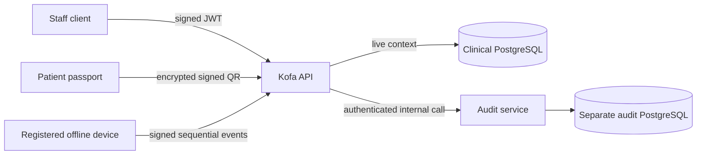

# Architecture

## System shape



The API is a modular monolith because clinical access, consent, roster management, and projection rules share a single transactional domain. Audit is a separate deployment because evidence must survive compromise of the clinical application and database.

## Request path

1. The JWT guard verifies issuer, audience, signature, expiry, algorithm, and session identifier.
2. `ContextService` resolves the Neon account and active duty assignment for that session.
3. `PolicyService` combines role with facility, ward, shift, case, self/dependent, and emergency facts.
4. The audit service commits a canonical event and returns a cryptographic receipt.
5. Only after the receipt exists does the clinical service fetch and project protected resources.
6. The response contains only permitted resources. Withheld fields are never serialized.

## Audit chain

The audit service serializes appends by locking one `chain_state` row in a serializable transaction. The event hash is:

```text
SHA-256(canonical-json(event-without-hash) || previousHash)
```

The runtime database account can insert and select audit events but cannot update or delete them. Idempotency keys make retries safe. The verifier reads sequence order, recomputes every hash and link, and reports the first broken entry. Abuse rules add separate review records without altering evidence.

## Authorization model

`packages/core/src/policy.ts` is the sole pure Policy Decision Point. Controllers never contain authorization shortcuts. A decision returns an allow/deny reason and an explicit field projection. Key cases are:

- Doctor: active assignment plus current case attachment.
- Nurse: active assignment plus matching ward; sensitive fields require a separately audited reveal.
- Clerk: demographics and billing within the facility only.
- Locum: rostered hours and ward/case scope, with sensitive data redacted.
- Lab/pharmacy: order linkage is deny-by-default until an order relationship exists.
- Audit officer: access metadata only.
- Administrator: roster and device administration only; never clinical read.
- Patient/caregiver: self or currently linked dependent.

## Emergency access

Institutional break-glass accepts only doctors and nurses with an active assignment. TOTP verification includes replay prevention. The audit append is awaited before the emergency session or summary is created. The session is patient-bound and expires after ten minutes.

Patient consent uses a facility-signed Ed25519 envelope encrypted with a PIN-derived Argon2id key and XSalsa20-Poly1305 authenticated encryption. A verified online use checks the grant's current status before recording and releasing the embedded summary.

## Offline staff model

An administrator activates a registered device containing distinct Ed25519 signing and X25519 encryption keys. The server encrypts a four-hour, scope-bound cache to that device. Offline reads create signed events with a strictly increasing sequence. Synchronization rejects signature failures, gaps, replays, unknown manifests, expired cache use, and patient references outside the cached scope.

## Deployment boundary

The local configuration uses separate databases and credentials. In production:

- terminate public TLS at a trusted ingress;
- enforce mTLS between API and audit service using a service mesh or private ingress;
- keep the audit database on a separate account/network boundary;
- source signing and encryption keys from KMS/HSM-backed secrets;
- prevent API workloads from reaching the audit database directly;
- export signed audit checkpoints to immutable object storage.
